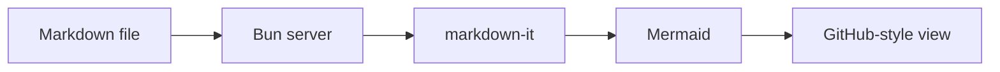

# Markdown + Mermaid preview

This page is rendered inside the container with **GitHub-style Markdown**.

## Mermaid diagram



## Markdown features

- [x] Tables, task lists, and fenced code
- [x] Syntax highlighting
- [x] Relative images and links
- [x] Light and dark color schemes

| Component | Purpose |
| --- | --- |
| Bun | HTTP server and frontend bundler |
| Mermaid | Diagram rendering |
| DOMPurify | Output sanitization |

```ts
const message: string = "Rendered locally";
console.log(message);
```
