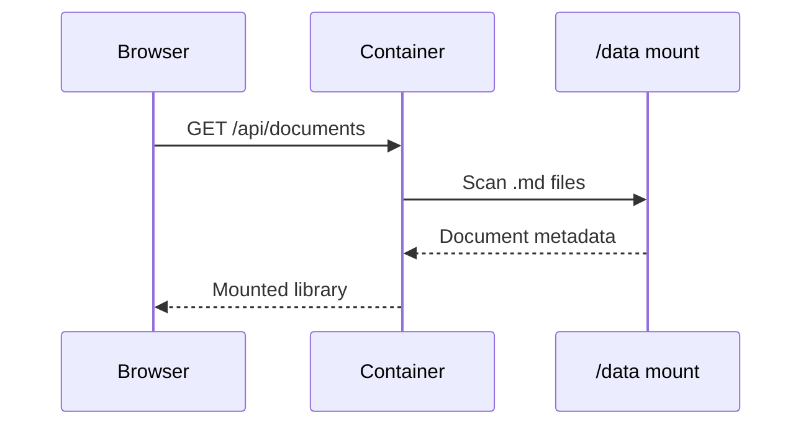

# Architecture

Mounted directories are scanned recursively, so documents can be organized into folders.

Return to `document.md` from the mounted files list, or add local documents with the file picker and drag-and-drop zone.
